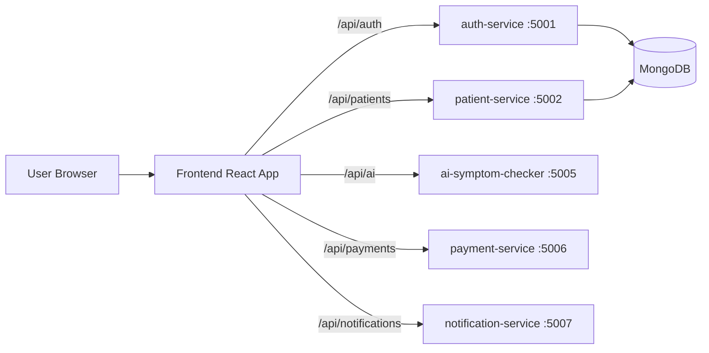

# Developer Guide

This document explains how the system is implemented and how to run and validate it.

## 1. Architecture Overview

The platform is built as a frontend plus independent backend microservices.

### Frontend

- Stack: React (`frontend/`)
- Runtime API config is injected at container startup (`frontend/docker-entrypoint.sh`)
- API client layer is in `frontend/src/services/api.js`

### Backend services

- auth-service (`services/auth-service`) - registration, login, current user, JWT
- patient-service (`services/patient-service`) - profile create/read/update, report APIs
- ai-symptom-checker (`services/ai-symptom-checker`) - symptom triage endpoint
- payment-service (`services/payment-service`) - checkout session creation
- notification-service (`services/notification-service`) - email notification endpoint

## 2. Frontend UI and API Wiring

### Routes currently enabled

- `/` landing page
- `/login` sign-in page
- `/register` registration page
- `/patient` patient dashboard
- `/patient/profile` patient profile form
- `/patient/symptom-checker` AI symptom checker page
- `/patient/book-appointment` appointment page
- `/doctor` doctor page
- `/admin` admin page

### Frontend API base keys

Read in `frontend/src/services/api.js` using runtime-config helper:

- `REACT_APP_AUTH_API_URL`
- `REACT_APP_PATIENT_API_URL`
- `REACT_APP_AI_API_URL`
- `REACT_APP_PAYMENT_API_URL`
- `REACT_APP_NOTIFICATION_API_URL`

Kubernetes frontend deployment sets all of these to:

- `http://smart-healthcare.local/api`

So requests become:

- auth: `/api/auth/*`
- patient: `/api/patients/*`
- ai: `/api/ai/*`
- payments: `/api/payments/*`
- notifications: `/api/notifications/*`

## 3. Kubernetes Setup

## 3.1 Prerequisites

- Docker Desktop running
- Kubernetes enabled in Docker Desktop
- `kubectl` installed
- context is `docker-desktop`

Verify:
This guide explains how the system is implemented and how to run it in both Kubernetes and local development modes.

## 1. System Overview

The platform is split into a React frontend and independent Node.js microservices.

- frontend: React client app
- auth-service: user registration/login and JWT issuance
- patient-service: patient profiles and medical reports
- ai-symptom-checker: symptom triage suggestions
- payment-service: Stripe or mock payment checkout
- notification-service: email notifications (SMS path currently disabled)

## 2. Current Architecture



Implementation references:

- Frontend API base URLs are in `frontend/src/services/api.js`.
- Runtime-injected frontend config is in `frontend/docker-entrypoint.sh`.
- Kubernetes ingress routing is in `k8s/ingress.yaml`.

## 3. Service Map

| Service | Folder | Default Port | Key Endpoints |
|---|---|---:|---|
| Frontend | `frontend` | 3000 (local), 80 (container) | `/` |
| Auth | `services/auth-service` | 5001 | `/api/auth/register`, `/api/auth/login`, `/api/auth/me` |
| Patient | `services/patient-service` | 5002 | `/api/patients/*` |
| AI Symptom Checker | `services/ai-symptom-checker` | 5005 | `/api/ai/check-symptoms`, `/api/health` |
| Payment | `services/payment-service` | 5006 | `/api/payments/checkout`, `/api/health` |
| Notification | `services/notification-service` | 5007 | `/api/notifications/send`, `/api/notifications/health` |

## 4. Kubernetes Deployment (Project Default)

### 4.1 Prerequisites

- Docker Desktop installed
- Kubernetes enabled in Docker Desktop
- `kubectl` installed and working
- Active context set to `docker-desktop`

Useful checks:

```powershell
kubectl config current-context
kubectl get nodes
```

## 3.2 Build images

From repository root:

```powershell
docker build -t frontend-image:latest .\frontend
docker build -t ai-symptom-checker-image:latest .\services\ai-symptom-checker
docker build -t auth-service-image:latest .\services\auth-service
docker build -t patient-service-image:latest .\services\patient-service
docker build -t payment-service-image:latest .\services\payment-service
docker build -t notification-service-image:latest .\services\notification-service
```

## 3.3 Configure and apply secrets
### 4.2 Build Docker images used by manifests

Run from repository root:

```powershell
docker build -t frontend-image:latest ./frontend
docker build -t ai-symptom-checker-image:latest ./services/ai-symptom-checker
docker build -t auth-service-image:latest ./services/auth-service
docker build -t payment-service-image:latest ./services/payment-service
docker build -t notification-service-image:latest ./services/notification-service
docker build -t patient-service-image:latest ./services/patient-service
```

Notes:

- Kubernetes manifests use `imagePullPolicy: Never`, so local images must exist in Docker Desktop.
- Auth and patient services are now deployed via `k8s/auth-deployment.yaml` and `k8s/patient-deployment.yaml`.

### 4.3 Configure secrets

1. Create secret manifest from template:

```powershell
Copy-Item .\k8s\auth-secret.example.yaml .\k8s\auth-secret.yaml
Copy-Item .\k8s\patient-secret.example.yaml .\k8s\patient-secret.yaml
Copy-Item .\k8s\payment-secret.example.yaml .\k8s\payment-secret.yaml
```

Fill each file with real values, then apply:
2. Edit all created secret files and set real values.
3. Apply secrets:

```powershell
kubectl apply -f .\k8s\auth-secret.yaml
kubectl apply -f .\k8s\patient-secret.yaml
kubectl apply -f .\k8s\payment-secret.yaml
```

## 3.4 Apply all manifests
### 4.4 Apply Kubernetes manifests

```powershell
Get-ChildItem .\k8s\*.yaml |
  Where-Object { $_.Name -notin @('auth-secret.example.yaml', 'patient-secret.example.yaml', 'payment-secret.example.yaml') } |
  ForEach-Object { kubectl apply -f $_.FullName }
```

## 3.5 Ingress and access

Ingress host:

- `smart-healthcare.local`

Add host mapping locally:

- `127.0.0.1 smart-healthcare.local`

Open app:

- `http://smart-healthcare.local`

## 3.6 Verify deployment health
### 4.5 Access through ingress

1. Add host mapping:

- `127.0.0.1 smart-healthcare.local`

2. Open:

- `http://smart-healthcare.local`

Current ingress paths in `k8s/ingress.yaml`:

- `/` -> frontend-service (80)
- `/api/auth` -> auth-service (5001)
- `/api/patients` -> patient-service (5002)
- `/api/ai` -> ai-symptom-checker-service (5005)
- `/api/payments` -> payment-service (5006)
- `/api/notifications` -> notification-service (5007)

### 4.6 Verify deployment

```powershell
kubectl get deployments
kubectl get pods -o wide
kubectl get svc
kubectl get ingress
```

Expected:

- all deployments `READY 1/1`
- all relevant pods `Running`

## 4. Postman API Verification

Artifacts:

- collection: `postman/telemedicine-services.postman_collection.json`
- local env: `postman/telemedicine-local.postman_environment.json`
- k8s env: `postman/telemedicine-k8s.postman_environment.json`

### Key variables used

- `auth_base_url`
- `patient_base_url`
- `ai_base_url`
- `payment_base_url`
- `notification_base_url`
- `auth_token`
- `auth_user_id`

### Recommended smoke sequence

1. Register Patient
2. Login Patient
3. Get Current User
4. Create Patient Profile
5. Get Patient Profile
6. Update Patient Profile

## 5. Core Kubernetes Files

- `k8s/frontend-deployment.yaml` - frontend deployment + runtime API env vars
- `k8s/ingress.yaml` - all API and frontend path routing
- `k8s/auth-deployment.yaml` - auth pod config
- `k8s/auth-service.yaml` - auth cluster service
- `k8s/patient-deployment.yaml` - patient pod config
- `k8s/patient-service.yaml` - patient cluster service
- `k8s/auth-secret.example.yaml` - auth secret template
- `k8s/patient-secret.example.yaml` - patient secret template
- `k8s/payment-secret.example.yaml` - payment secret template

## 6. Security and Collaboration Notes

- Never commit real secret values.
- Keep `.env` local only.
- Keep secret templates in Git and real secret files out of Git.
- Use Postman environment files for shared testing setup.

## 7. Troubleshooting

### Frontend still showing old version

- Rebuild image: `docker build -t frontend-image:latest .\frontend`
- Restart deployment: `kubectl rollout restart deployment/frontend-deployment`
- Wait for rollout: `kubectl rollout status deployment/frontend-deployment`
- Hard refresh browser (`Ctrl+F5`)

### Kubernetes apply fails with localhost:6443 connection error

- Docker Desktop Kubernetes is not ready.
- Wait until Kubernetes status is running, then retry.

### Auth or Patient requests fail with 401

- Ensure JWT secret matches where needed.
- Re-login to refresh token in frontend/postman.

### Auth or Patient fails to start in cluster

- Check secret exists: `kubectl get secret auth-service-secrets patient-service-secrets`
- Check logs:

```powershell
kubectl logs deployment/auth-service-deployment
kubectl logs deployment/patient-service
```
Optional: skip patient-service while continuing with the rest:

```powershell
kubectl scale deployment patient-service --replicas=0
```

## 5. Local Development Run (All Services)

Use this mode when you need full auth + patient functionality and direct service debugging.

### 5.1 Frontend

```powershell
cd frontend
npm install
npm start
```

Frontend defaults in `frontend/src/services/api.js`:

- auth: `http://localhost:5001/api`
- patient: `http://localhost:5002/api`
- ai: `http://localhost:5005/api`
- payment: `http://localhost:5006/api`
- notification: `http://localhost:5007/api`

### 5.2 Backend services

For each service below, open a separate terminal, create a `.env` file if needed, and run `npm install` then `npm start`.

#### auth-service (`services/auth-service`)

Required environment variables:

- `MONGODB_URI`
- `JWT_SECRET`
- `JWT_EXPIRES_IN`
- optional `PORT` (default `5001`)

#### patient-service (`services/patient-service`)

Required environment variables:

- `MONGODB_URI`
- `JWT_SECRET`
- optional `PORT` (default `5002`)

#### ai-symptom-checker (`services/ai-symptom-checker`)

Optional environment variables:

- `GEMINI_API_KEY`
- `GEMINI_MODEL` (default `gemini-2.0-flash`)
- optional `PORT` (default `5005`)

If `GEMINI_API_KEY` is missing/invalid, service runs in fallback recommendation mode.

#### payment-service (`services/payment-service`)

Optional environment variables:

- `STRIPE_SECRET_KEY`
- `PAYMENT_MOCK_ONLY` (`true` or `false`)
- `FRONTEND_BASE_URL`
- `PAYMENT_SUCCESS_URL`
- `PAYMENT_CANCEL_URL`
- optional `PORT` (default `5006`)

Without `STRIPE_SECRET_KEY`, checkout works in mock mode.

#### notification-service (`services/notification-service`)

Optional environment variables:

- `EMAIL_USER`
- `EMAIL_APP_PASSWORD`
- `EMAIL_SEND_TIMEOUT_MS`
- optional `PORT` (default `5007`)

Without email credentials, notification requests are handled in mock/degraded mode.

## 6. Known Gaps and Important Notes

- Some manifests include hardcoded sample secrets/keys. Move real secrets to secure secret management before production use.

## 7. Troubleshooting

### Kubernetes API not reachable

Symptom:

- `kubectl apply` fails with connect errors to `127.0.0.1:6443`

Fix:

- Start Kubernetes in Docker Desktop and wait until status is Running.
- Re-run `kubectl get nodes`.

### ImagePullBackOff

Symptom:

- Pod stuck in `ImagePullBackOff`

Fix:

- Build the missing image with the exact image tag expected in the deployment.
- Re-apply deployment or delete failing pod.

### Frontend reachable but API calls fail

Fix checklist:

- Confirm frontend runtime env vars (`frontend/docker-entrypoint.sh` values).
- Confirm ingress path exists for target API.
- Confirm backend pod is Running and service is present.

## 8. Suggested Next Improvements

- Add k8s deployment/service/ingress for auth-service and patient-service.
- Add `.env.example` files to each service.
- Add one root script (or Makefile) to build images and apply manifests in one command.
- Move credentials out of manifests into proper Kubernetes Secrets only.
